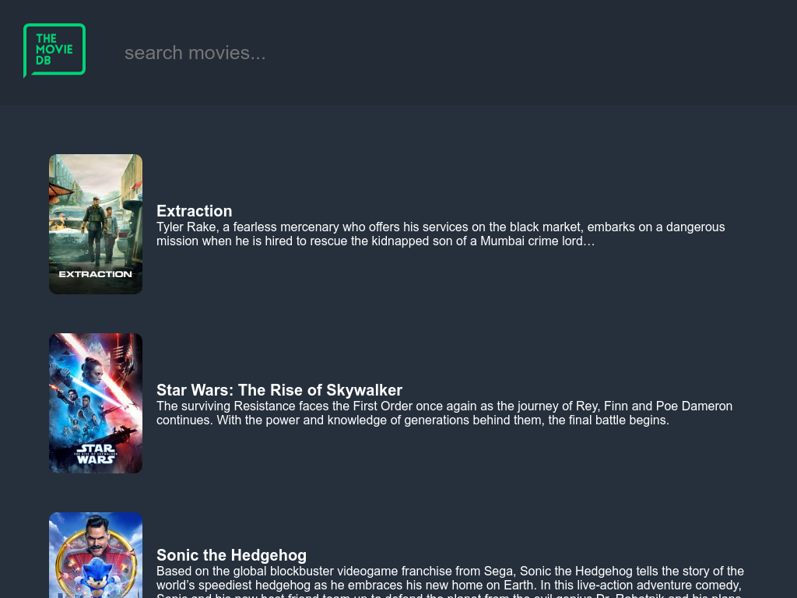

<div align="center">
  
</div>
<h1 align="center">
  Flow by zxffo
</h1>
<p align="center">
  This is a react movie search app for a personal project. <a href="https://zxffo.github.io/flow" target="_blank">view it here</a>
</p>



## 🛠 Installation & Set Up

1. Clone the repo

   ```sh
   git clone https://github.com/zxffo/flow/
   ```

2. Install and use the correct version of Node using [NVM](https://github.com/nvm-sh/nvm)

   ```sh
   nvm install
   ```

3. Install dependencies

   ```sh
   npm i
   ```

4. Start the development server

   ```sh
   npm start
   ```

## 🎨 Color Reference

| Color      | Hex                                                                |
| ---------- | ------------------------------------------------------------------ |
| Navbar     |  `#26303c` |
| Background |  `#222b36` |
